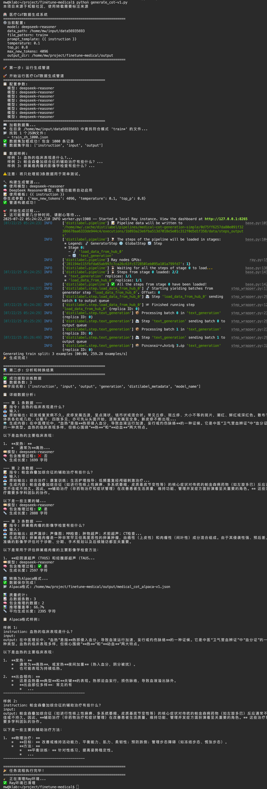
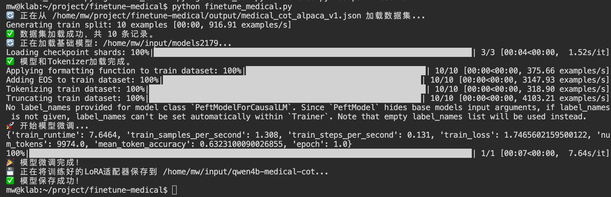
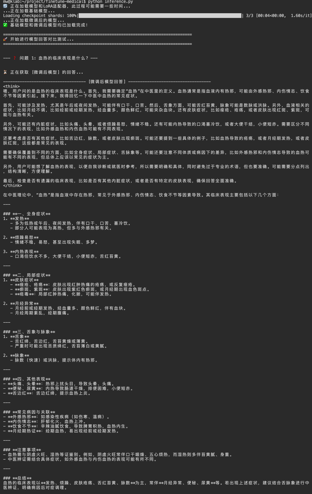

# 一、基础环境准备
```
sudo apt update -y    
sudo apt install -y vim tree   
 
pip config set global.index-url https://mirrors.aliyun.com/pypi/simple/    
pip config set install.trusted-host mirrors.aliyun.com    

pip install "distilabel[openai]" "ray[default]" "datasets"
```

# 二、代码工程结构
```
(llm) xx@mbp-m4 hejing % tree finetune-medical
finetune-medical
├── 说明.md
├── finetune_medical.py
├── generate_cot.py
├── inference.py
├── output
├── raw
│   └── train_zh_1000.json
└── results
```

4 directories, 5 files

# 三、代码工程运行
## 1. 预处理数据
```
python generate_cot.py
```


## 2. 模型微调
```
python finetune_medical.py
```


## 3. 微调模型测试
```
python inference.py
```
